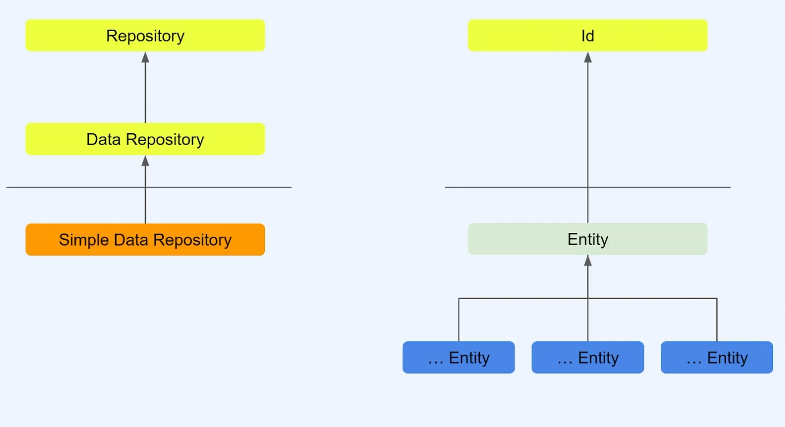

## 목차

- [REST API](#rest-api)
  - [GET](#get)
    - [Path Variable](#path-variable)
    - [Query Parameer](#query-parameer)
  - [POST](#post)
    - [HTTP BODY](#http-body)
    - [JSON 형식](#json-형식)
  - [PUT](#put)
  - [DELETE](#delete)
- [추가 공부 내용](#추가-공부-내용)
  - [변수 작성하기](#변수-작성하기)
    - [Snake Case](#snake-case)
    - [Camel Case](#camel-case)
  - [`@Slf4j`](#slf4j)
- [Spring Boot Web](#spring-boot-web)
  - [응답](#응답)
- [Object Mapper](#object-mapper)
- [직렬화와 역직렬화](#직렬화와-역직렬화)
  - [직렬화](#직렬화)
    - [예시](#예시)
- [JsonNode](#jsonnode)
- [ObjectMapper의 동작 과정](#objectmapper의-동작-과정)
- [Builder](#builder)
  - [예제](#예제)
- [Validation 사용 이유](#validation-사용-이유)
  - [Validation 종류](#validation-종류)
- [DataBase](#database)

<br/>
<br/>
<br/>
<br/>
<br/>
<br/>

# REST API

## GET

- 서버에 특정 데이터를 요청, 클라이언트가 응답
- 0 또는 1 비트 단위의 데이터가 전달되는 것
- 서버에서 어떤 문자 데이터를 만들어내느냐가 중요하다
- `@RestController` : REST API Controller임을 지정
- `@RequestMapping` : API 주소를 지정
- `@GetMapping` : 클라이언트에서 해당 주소로 GET Method를 통해 데이터를 보낸다

### Path Variable

- 주소 내에 정보를 전달하는 방법
  - (예) https://www.foo.bar/user-d/100
- 주소가 노출되기 때문에 주소에 대한 값을 변환시킬 수 있으므로 보안이 취약하다

```java
    @GetMapping(path = "/echo/{message}/age/{age}/is-man/{isMan}")
    public String echo(@PathVariable String message,
        @PathVariable int age,
        @PathVariable boolean isMan
    ) {
        System.out.println("echo message: " + message);
        System.out.println("echo age: " + age);
        System.out.println("echo isMan: " + isMan);
        return message.toUpperCase();
    }
```

### Query Parameer

- 특정 정보의 필터링을 걸 때 사용한다
- `?`로 시작하고 이어주는 형태는 `&`로 묶어준다
  - (예) https://www.foo.bar/book?category=IT&issuedYear=2023&issued-month=01&issued_day=31

```java
    @GetMapping("/book")
    public void queryParam(
        @RequestParam String category,
        @RequestParam String issuedYear,
        @RequestParam(name = "issued-month") String issuedMonth,
        @RequestParam String issuedDay
    ) {
        System.out.println(category);
        System.out.println(issuedYear);
        System.out.println(issuedMonth);
        System.out.println(issuedDay);
    }

    @GetMapping("/book2")
    public void queryParamDTO(
        BookQueryParam bookQueryParam
    ) {
        System.out.println(bookQueryParam);
    }

```

- 변수가 많을 경우 객체를 통해 파싱할 수 있다.

<br/>
<br/>

## POST

### HTTP BODY

- 특정한 메시지를 담을 수 있다. (TEXT, HTML, JSON 등)
- 외부 주소에는 해당 데이터가 노출되지 않는다
- JSON 형식을 가장 많이 쓴다.
- `@RequestBody` : POST, PUT Method에서 쓰이며 `HTTP Body`로 들어오는 데이터를 해당 객체에 매핑해준다.

```java
    // return type 에 따라 달라진다
    @PostMapping("/post")
    public String post(@RequestBody BookRequest bookRequest) {
        System.out.println(bookRequest);
        return bookRequest.toString();
    }
```

- return type에 따라 달라진다.

### JSON 형식

```JSON
{
	"key": "value",
	"array": [
		10,
		20,
		30
	],
	"string_array": [
		"홍길동", "이순신", "유관순"
	],
	"object_array": [
		{
			"name: "홍길동"
		},
		{
			"name: "이순신"
		},
		{
			"name: "유관순"
		}
	]
}
```

- `key-value` 형식이다.
- String, Number, Boolean, obejct({}), array([]) 등을 추가할 수 있다.

<br/>
<br/>

## PUT

- 해당 데이터가 존재한다면 갱신, 존재하지 않는다면 생성
- 요청할 때마다 데이터가 바뀌므로 안정성은 없다

```java
    @PutMapping("/put")
    public void put(@RequestBody UserRequest userRequest) {
        log.info("Request: {}", userRequest);
    }
```

<br/>
<br/>

## DELETE

- 리소스 삭제
- 몇 번이나 요청해도 동일 = 멱등성 O

```java
    @DeleteMapping(path = {"/user/{userName}/delete", "/user/{userName}/del"})
    public void delete(@PathVariable String userName) {
        log.info("user-name: {}", userName);
    }
```

<br/>
<br/>

# 추가 공부 내용

## 변수 작성하기

### Snake Case

- `_`로 구분
- user_name, user_age
- camel case에서 snake case로 변경하기
  ```java
  @JsonNaming(value = PropertyNamingStrategies.SnakeCaseStrategy.class)
  ```
  - JSON 형식에서 snake case로 작성해도 인식되도록 한다.
  - (예) userName = user_name

### Camel Case

- 소문자로 시작, 대문자로 구분
- userName, userAge

## `@Slf4j`

- `System.out.print`
  - 콘솔에 출력을 하고 실행되기 때문에 서버의 진행 속도가 저하가 된다.
- `log`로 찍기
  - buffer의 내용이 찍히므로 진행 속도에 영향을 많이 주지 않는다
- 가능하면 해당 어노테이션을 적용하여 `log.info` 등으로 콘솔을 찍는 것이 좋다.

<br/>
<br/>
<br/>
<br/>
<br/>

# Spring Boot Web

## 응답

1. String
   - 일반 Text Type 응답
2. Object
   - 자동으로 JSON 변환되어 응답
   - 상태값은 항상 200 OK
3. ResponseEntity

   - Body의 내용을 Object로 설정
   - 상황에 따라서 HttpStatus Code 설정
   - 예외가 발생할 때 사용

   ```java
       public ResponseEntity<UserRequest> user() {
           var user = new UserRequest();
           user.setUserName("홍길동");
           user.setUserAge(20);
           user.setEmail("hong@example.com");

           log.info("user: {}", user);

           var res = ResponseEntity
               .status(HttpStatus.OK)
               .header("x-custom", "hi")
               .body(user);

           return res;
       }
   ```

4. `@ResponseBody` (참고용)
   - RestController가 아닌 곳(Controller)에서 Json 응답을 내릴 때

<br/>
<br/>
<br/>
<br/>
<br/>

# Object Mapper

<aside>

Java 객체 → JSON (직렬화)

JSON → Java 객체 (역직렬화)

</aside>

- Jackson Library : Java 용 JSON 처리 라이브러리 (오픈 소스)
- 보통 Spring으로 개발하는 경우 `@RestController`를 많이 사용한다.
  - request와 response에서 직렬화/역직렬화 과정은 MessageConverter에 의해 처리된다.
  - 이 때 MessageConverter가 JSON 변환 처리 과정에서 사용하는 것이 바로 Jackson이다.
  - `ObjectMapper`는 `@RequestBody`가 Property로 구현되어 있거나 생성을 위임한 경우가 아니라면 **기본 생성자**로 생성한다.
  - 따라서 두 상황이 아니라면 기본 생성자는 꼭 필요하다. (`@NoArgsConstructor` (default 생성자 생성)가 필요한 이유)
  - 기본 생성자와 `getter` 메소드는 반드시 만들어주는 것이 좋다.

# 직렬화와 역직렬화

## 직렬화

- 객체의 상태를 바이트 스트림(JSON)으로 변환하는 과정
- 바이트 스트림은 파일, 데이터베이스, 메모리, 네트워크 등 다양한 매체에 저장되거나 전송될 수 있다.
- 용도
  - 영구 저장 : 객체를 파일이나 데이터베이스에 저장하여 나중에 복원할 수 있다.
  - 네트워크 전송 : 객체를 네트워크를 통해 다른 시스템으로 전송할 수 있다.
  - 캐시 : 객체를 캐시에 저장하여 빠르게 접근할 수 있다.
- JSON 자체는 바이트 스트림이 아니지만, JSON 데이터를 저장하거나 전송할 때는 바이트 스트림 형태로 처리된다

### 예시

```java
@Data
@AllArgsConstructor
@NoArgsConstructor
public class UserRequest {

    private String userName;
    private Integer userAge;
    private String email;
    private Boolean isKorean;

}
```

```java
var user = new UserRequest();
		user.setUserName("홍길동");
		user.setUserAge(10);
		user.setEmail("hong@example.com");
		user.setIsKorean(true);

		var json = objectMapper.writeValueAsString(user);
		System.out.println(json);
		var dto = objectMapper.readValue(json, UserRequest.class);
		System.out.println(dto);
```

⇒ 출력

```java
{"user_name":"홍길동","user_age":10,"email":"hong@example.com","is_korean":true}
UserRequest(userName=홍길동, userAge=10, email=hong@example.com, isKorean=true)

```

# JsonNode

- JSON 데이터를 트리 구조로 표현하는 데 사용
- JSON 데이터의 특정 요소에 접근하거나 조작하는 기능을 제공
- get(String fieldName): 지정된 필드 이름의 값을 반환한다.
- asText(), asInt(), asBoolean(), asDouble(): 노드의 값을 다양한 타입으로 반환한다.
- put(String fieldName, String value): JSON 객체의 필드를 업데이트한다.
- toPrettyString(): JSON 트리 구조를 보기 좋은 형식으로 문자열로 변환한다.

# ObjectMapper의 동작 과정

- Jackson은 기본적으로 프로퍼티로 동작한다. → getter/setter
- JSON 필드의 이름을 Java object의 getter 및 setter 메서드와 일치시켜 JSON 오브젝트의 필드를 Java object 필드에 매칭한다.
  - Jackson은 getter 및 setter 메소드 이름의 "get"및 "set"부분을 제거하고 나머지 이름의 첫 문자를 소문자로 변환
- `@JsonIgnore` : 직렬화 대상이 아닌 것을 제외하여 파싱 에러 해결
- DTO에 필드 값을 주입할 때 `reflection`을 사용해서 값을 주입한다.
  ⇒ 기본 생성자는 필요하고 `setter`는 필요하지 않다.
  접근 제어자를 `private`으로 설정해도 실행되기 때문에 빈 객체 생성을 막아주기 위해서 `private` 설정이 좋다.
- `getter`만 존재 ⇒ 에러 발생 X
- `setter`만 존재 ⇒ 에러 발생 X
- `getter` & `setter` 없음 ⇒ 에러 발생 O
  - 생성자 내 파라미터에 `@Jsonproperty` 붙여서 사용하라고 알려주면 에러 발생하지 않는다.

# Builder

- 여러 설정을 순차적으로 사용해야 할 때 유용하다
- 메서드 체이닝을 통해 설정을 적용할 수 있으므로 구성 코드의 가독성이 향상된다.
- 빌더 패턴을 이용하면 불변 객체를 생성할 수 있다. ⇒ 동시성 문제 피하는데 도움이 된다
- 단점
  - 불필요한 복잡성 초래 가능
  - 빌더 클래스를 정의하고 사용하는 것이 코드 오버 헤드를 발생시킬 수 있으므로 꼭 필요한 경우에만 사용하는 것이 메모리 관리 측면에서 효율적이다.
  - 객체를 생성하기 전에 여러 메서드를 호출해야 하므로 성능에 민감한 상황에서 약간의 성능 저하가 발생할 수 있다.

### 예제

```java
@Data
@Builder
@NoArgsConstructor
@AllArgsConstructor
public class BookCommentLikeResponse {

    private Long id;
    private boolean isDeleted;
    private Long userId;
    private Long commentId;

}
```

```java
// 업데이트된 좋아요 저장
bookCommentLikeRepository.save(BookCommentLike.builder()
	.id(like.getId())
	.isDeleted(newIsDeleted)
	.user(like.getUser())
	.commentId(like.getCommentId())
	.build());
```

<br/>
<br/>
<br/>
<br/>
<br/>

# Validation 사용 이유

1. 유효성 검증하는 코드의 길이가 너무 길다
2. service logic에 대해서 방해가 된다  
   (request에 대한 검증이다)
3. 흩어져 있는 경우 어디서 검증되었는지 찾기 힘들다
4. 검증 로직이 변경되는 경우 테스트 코드 등 전체 로직이 흔들릴 수 있다

## Validation 종류

- `@Size` 문자 길이 측정 (int type 불가)
- `@NotNull` nul l불가
- `@NotEmpty` null 불가, ""불가
- `@NotBlack` null, ""," " 불가
- `@Pattern` 정규식 적용
- `@Max` 최대값
- `@Min` 최소값
- `@AsserTrue/False` 별도 logic 적용
- `@Valid` 해당 object validation 실행
- `@Past` 과거 날짜
- `@PastOrPresent` 오늘이거나 과거 날짜
- `@Future` 미래 날짜
- `@FutureOrPresent` 오늘이거나 미래 날짜

<br/>
<br/>
<br/>
<br/>
<br/>

# DataBase



- 데이터의 저장소
- DBMS (DataBase Management System) : 데이터베이스를 운영하고 관리하는 소프트웨어
